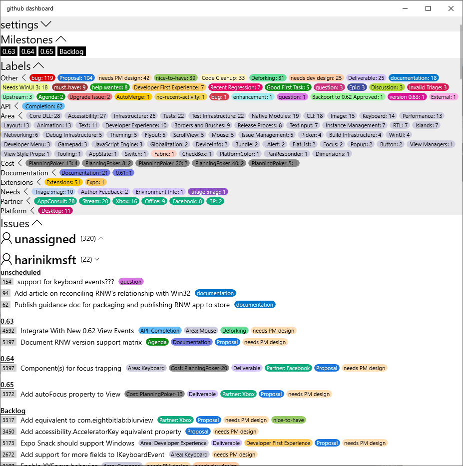

# react-native-github-dashboard

A React Native application for querying GitHub issues and display in a grouped/filtered way:
- Grouped by Assignee
- Grouped by Milestone
- Filterable by Milestone
- Filterable by Label
Issues when clicked will launch the GitHub webpage for that issue.

